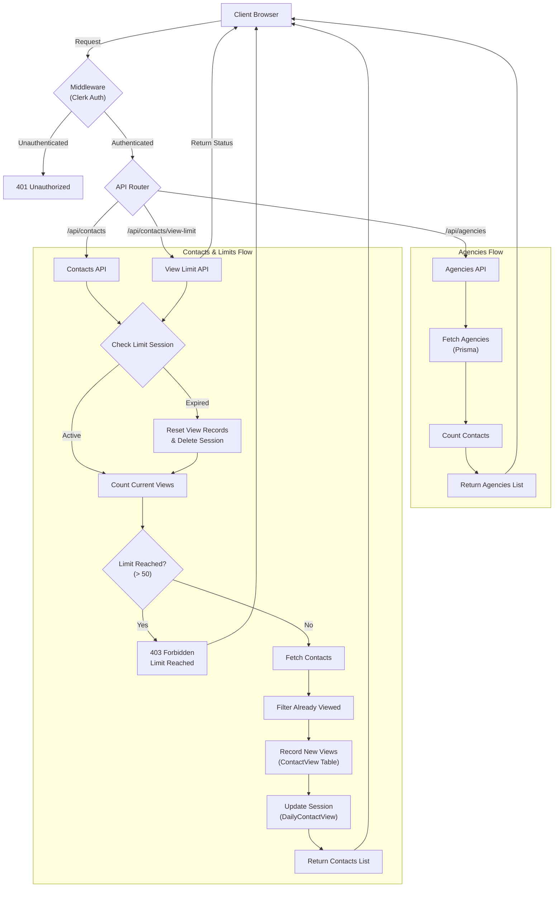

# Dashboard Application

A Next.js dashboard application for managing agencies and contacts with Clerk authentication and configurable view limits.

## Features

- 🔐 **Clerk Authentication** - Secure user authentication
- 🏢 **Agencies Management** - View all agencies in a table
- 👥 **Contacts Management** - View contacts with configurable daily limits
- 💎 **Premium Upgrade** - Premium popup when limit is reached
- 📊 **Shadcn UI Tables** - Beautiful, accessible data tables
- 🗄️ **Prisma + SQLite** - Type-safe database with automatic CSV import
- ⚡ **Next.js 16** - Latest Next.js with Turbopack

## Getting Started

### 1. Install Dependencies

```bash
npm install
```

**Note:** CSV data is automatically imported during installation via the postinstall hook.

### 2. Set Up Environment Variables

Create a `.env.local` file in the project root and add your Clerk keys and configuration:

```bash
NEXT_PUBLIC_CLERK_PUBLISHABLE_KEY=your_publishable_key
CLERK_SECRET_KEY=your_secret_key

# Optional: Configure contact view limit window in hours (default: 24)
CONTACT_LIMIT_HOURS=24
```

Get your keys from [Clerk Dashboard](https://dashboard.clerk.com/).

### 3. Run the Development Server

```bash
npm run dev
```

Open [http://localhost:3000](http://localhost:3000) to view the application.

### 4. Sign Up and Explore

- Click "Sign Up" to create an account
- Navigate to **Agencies** to view all agencies
- Navigate to **Contacts** to view contacts (limited to 50 per configured window)
- **Dev Tools**: Use the "Reset Limits" button in the contacts page to reset your view count for testing.

## Database

The application uses SQLite with Prisma ORM. CSV data from `public/agencies_agency_rows.csv` and `public/contacts_contact_rows.csv` is automatically imported on first install.

To manually re-import data:

```bash
npm run import-data
```

To reset the database:

```bash
npx prisma migrate reset --force
```

## Project Structure

```
app/
├── agencies/          # Agencies page
├── contacts/          # Contacts page with view limiting
├── api/              # API routes
│   ├── contacts/     # Contact endpoints
│   │   ├── route.ts      # Main contacts API with limit logic
│   │   ├── view-limit/   # Check current limit status
│   │   └── reset-limits/ # Dev tool to reset limits
│   └── import/       # CSV import endpoints
├── lib/              # Utilities (Prisma client)
└── layout.tsx        # Root layout with Clerk

components/ui/        # Shadcn UI components
prisma/              # Database schema and migrations
scripts/             # CSV import script
public/              # CSV data files
```

## System Design

The following diagram illustrates the high-level architecture and data flow of the application, specifically focusing on the Contact Viewing System and its limit enforcement logic.



## Available Scripts

- `npm run dev` - Start development server
- `npm run build` - Build for production
- `npm run start` - Start production server
- `npm run lint` - Run ESLint
- `npm run import-data` - Import CSV data manually

## Learn More

To learn more about Next.js, take a look at the following resources:

- [Next.js Documentation](https://nextjs.org/docs) - learn about Next.js features and API.
- [Learn Next.js](https://nextjs.org/learn) - an interactive Next.js tutorial.

You can check out [the Next.js GitHub repository](https://github.com/vercel/next.js) - your feedback and contributions are welcome!

## Deploy on Vercel

The easiest way to deploy your Next.js app is to use the [Vercel Platform](https://vercel.com/new?utm_medium=default-template&filter=next.js&utm_source=create-next-app&utm_campaign=create-next-app-readme) from the creators of Next.js.

Check out our [Next.js deployment documentation](https://nextjs.org/docs/app/building-your-application/deploying) for more details.
